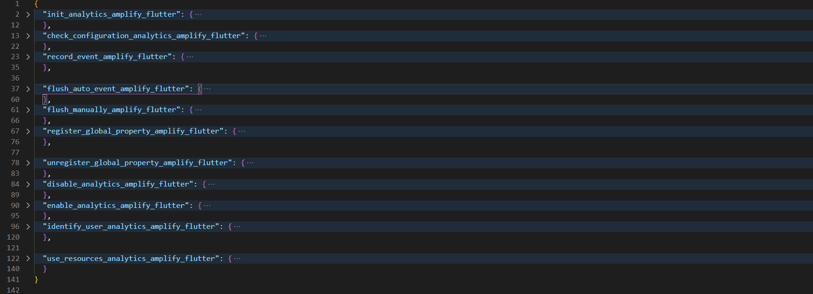

# AWS-Amplify-Flutter-Snippet FOR VSCODE

Over 40 code snippets for [AWS Amplify Flutter](https://docs.amplify.aws/lib/q/platform/flutter).
This extension for VSCode contains over 40 code snippets for the AWS Amplify Flutter.The code snippets are taken from the latest official documentation and cover the following topics:
* Authentication
* Initializing a new AWS Amplify project in Flutter
* Analytics
* Dependencies(YAML)
* Storage

## Features

40+ code snippets for  AWS Amplify (Flutter),which will help you speed up your development workflow.All code snippets are taken from the the official documentation.

## Init project

| command        | description         | 
| ------------- |:-------------:|
| import_amplify_packages_flutter      | import amplify packages |
| init_blank_app_amplify_flutter   |  Add the following code to your application’s root Stateful Widget, for a blank Flutter app    |
| init_blank_app_amplify_flutter   |  Add the Auth and Analytics plugin, along with any other plugins you may have added as described in the Prerequisites section    |

## Dependencies

| command        | description         | 
| ------------- |:-------------:|
| add_all_dependencies_amplify_flutter      | add all necessary dependencies |
| add_analytics_dependencies_amplify_flutter   |  add analytics dependencies    |
| add_storage_dependencies_amplify_flutter      | add storage dependencies  |
| add_authentication_dependencies_amplify_flutter   |  add authentication dependencies     |

## Analytics

| command        | description         | 
| ------------- |:-------------:|
| init_analytics_amplify_flutter      | Add the Auth and Analytics plugin, along with any other plugins you may have added as described in the Prerequisites section |
| init_blank_app_amplify_flutter   |  Add the Auth and Analytics plugin, along with any other plugins you may have added as described in the Prerequisites section    |
| check_configuration_analytics_amplify_flutter      | check that the amplifyconfiguration.dart file generated in the project setup is included and sent to Amplify.configure |
| record_event_amplify_flutter   |  The Amplify analytics plugin also makes it easy to record custom events within the app. The plugin handles retry logic in the event the device looses network connectivity and automatically batches requests to reduce network bandwidth    |
| flush_auto_event_amplify_flutter    | Events have default configuration to flush out to the network every 30 seconds. If you would like to change this, update amplifyconfiguration.json with the value in milliseconds you would like for autoFlushEventsInterval. This configuration will flush events every 10 seconds |
| flush_manually_amplify_flutter   |  manually flush    |
| register_global_property_amplify_flutter      | register global properties which will be sent along with all invocations of Amplify.Analytics.recordEvent |
| unregister_global_property_amplify_flutter  |  unregister a global property   |
| disable_analytics_amplify_flutter      | disable analytics in amplifys |
| enable_analytics_amplify_flutter   |  enable analytics in amplify   |
| identify_user_analytics_amplify_flutter      | This call sends information that you have specified about a user to Amazon Pinpoint. This could be for an unauthenticated (guest) or an authenticated user.You can get the current user’s ID from the Amplify Auth category as shown below. Be sure you have it added and setup per the Auth category documentation.If you have asked for location access and received permission, you can also provide that in AnalyticsUserProfileLocation |
| use_resources_analytics_amplify_flutter  |  Existing Amazon Pinpoint resources can be used with the Amplify Libraries by referencing your Application ID and Region in your amplifyconfiguration.json file    |

## Authentication

| command        | description         | 
| ------------- |:-------------:|
| init_authentication_amplify_flutter      | Add the Auth plugin, along with any other plugins you may have added as described in the Prerequisites section |
| register_user_amplify_flutter   |  register user requires a username, password and a valid email id as parameters to register a user. Invoke the following api to initiate a sign up flow   |
| confirm_signup_amplify_flutter      | A confirmation code will be sent to the email id provided during sign up. Enter the confirmation code received via email in the confirmSignUp call  |
| signin_user_amplify_flutter   | sign in user UI to get the username and password from the user. After the user enters the username and password you can start the sign in flow by calling the following method     |
| reset_password_amplify_flutter  |send a code to the user attribute configured to receive such a reset code (e.g. email or SMS,To complete the password reset process, invoke the confirmResetPassword api with the code you were sent and the new password you want |
| confirm_resetpassword_amplify_flutter   |  invoke the confirmResetPassword api with the code you were sent and the new password you want.Note that you must call confirmResetPassword in the same app session as you call resetPassword. If you close the app, you'll need to call resetPassword again. As a result, for testing purposes, you'll at least need an input field where you can enter the code sent by the resetPassword api and feed it to confirmResetPassword   |
| update_password_amplify_flutter      | A signed in user can update their password using the updatePassword api |
| signout_user_amplify_flutter  |  Invoke the signOut api to sign out a user from the Auth category. You can only have one user signed in at a given time.Calling signOut without any options will just delete the local cache and keychain of the user    |
| signout_user_all_devices_amplify_flutter  |  sign out of all devices, invoke the signOut api with advanced options   |
|accessing_credentials_amplify_flutter|directly access the credentials,If the getAWSCredentials option is true, the result will contain AWS credentials and tokens. If it is set to false, the result will contain a simple isSignedIn flag.|

## Dependencies

| command        | description         | 
| ------------- |:-------------:|
| import_storage_packages_amplify_flutter| import storage packages |
| init_storage_amplify_flutter |  initialize the Amplify Auth and Storage categories you call Amplify.addPlugin() method for each category. To complete initialization call Amplify.configure()    |
| upload_data_to_bucket_amplify_flutter    | upload to S3 from a data object, specify the key and the data object to be uploaded  |
| upload_files_to_bucket_amplify_flutter  |  upload to S3 from a data object, specify the key and the data object to be uploaded    |
| protected_file_access_amplify_flutter| Create an options object specifying the protected access level to allow other users to read the object |
| read_protected_file_amplify_flutter |  For the user to read the protected file, you must specify the user ID of the creating user in the passed options    |
| private_file_access_amplify_flutter| Create an options object specifying the private access level to allow other users to read the object |
| read_private_file_amplify_flutter |  For the user to read the private file, you must specify the user ID of the creating user in the passed options    |
| download_files_amplify_flutter    | If you uploaded the data using the key ExampleKey, you can retrieve the data using Amplify.Storage.downloadFile.  |
| generate_download_url_amplify_flutter  | retrieve a URL for the object in storage     |
| list_all_files_storage_amplify_flutter |  list all of the objects uploaded under a given prefix. This will list all public files    |
| list_private_protected_files_storage_amplify_flutter| list private or protected files by passing options. For example, to list all protected files owned by a user identified by the ID otherUserID |
| remove_files_storage_amplify_flutter|  To delete an object uploaded to S3, use Amplify.Storage.remove and specify the key    |
| use_resources_storage_amplify_flutter    | An existing Amazon S3 bucket can be used with the Amplify Libraries by referencing it in your amplifyconfiguration.dart file.  |

## Prerequisites

- Node.js v10.x or later
- npm v5.x or later
- git v2.14.1 or later
- Amplify CLI

- Install Flutter version 1.20.0 or higher
- Setup your IDE
- Android API level 16 (Jelly Bean) or higher
- iOS platform version of at least 11.0.
[Create AWS Account](https://portal.aws.amazon.com/billing/signup?redirect_url=https%3A%2F%2Faws.amazon.com%2Fregistration-confirmation#/start)

## Terminal commands which are good to know
- npm install -g @aws-amplify/cli@flutter-preview
- amplify configure
- amplify add analytics
- amplify add auth
- amplify add storage
- amplify push
- amplify console analytics

## Known Issues

## Release Notes
- this project is created by [congnguyendinh0](https://github.com/congnguyendinh0), and is not an official product by AWS.
### 1.0.0

